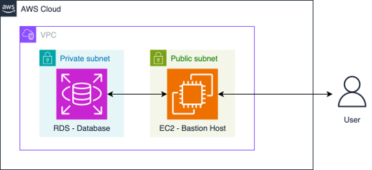

# Bastian Host Configuration (EC2) with RDS using SSH

Connect Authorized Users from public internet to resources hosted on a private network via a bastian host.
This is done by using SSH to securely access the resources. 



In the architecture, we have RDS database hosted inside a private subnet
of a given VPC, and an EC2 instance that acts as a bastion host. 
EC2 resides in a public subnet within the same VPC so it can receive 
external traffic from public internet. 

## Files
[`backend.tf`](terraform/backend.tf) -> The local backend block defines the local path, 
where `tfstate` will be stored.

`variables.tf`
- the main `variables.tf` file
  ([terraform/variables.tf](terraform/variables.tf)) : it contains the
  definitions for the variables used in the `main.tf` file. These variables are
  used to pass values to the input variables of the `bastion_host` module.
- the `variables.tf` file in the `bastion_host` module
  ([terraform/modules/bastion_host/variables.tf](terraform/modules/bastion_host/variables.tf)):
  it contains the definitions for the variables used in the configuration files
  inside the module.

`terraform.tfvars` file
([terraform/terraform.tfvars](terraform/terraform.tfvars)) - Used to inject values for the variables defined in the files above. 
> **IMPORTANT**
> ALWAYS ADD THIS FILE TO .gitignore

`network.tf` file
([terraform/modules/bastion_host/network.tf](terraform/modules/bastion_host/network.tf)),
you can find the resources and data sources associated with the networking
management, such as the VPC, subnets and security groups.

- VPC and its subnets are declared as [Data Blocks](https://www.terraform.io/language/data-sources) in
the `network.tf` file. The data block that declares the VPC are type [`aws_vpc`]
and the data blocks for the corresponding subnets data blocks of type
[`aws_subnet`](https://registry.terraform.io/providers/hashicorp/aws/latest/docs/data-sources/subnet)
for each of the public and private subnets of the VPC. To define the `id`
argument in each data block, we use the variables that represent the
ID of each subnet from the [variables.tf
file](terraform/modules/bastion_host/variables.tf) of the `bastion_host` module.

- The two remaining blocks in the
  [`network.tf`](terraform/modules/bastion_host/network.tf) file declare two resources of type
  [`aws_security_group`](https://registry.terraform.io/providers/hashicorp/aws/latest/docs/resources/security_group)
  that define the security groups that will be attached to the RDS database and
  to the bastion host.

We will use these networking resources in the configuration files of RDS and
EC2 (bastion host) instances.

`rds.tf`file
([terraform/modules/bastion_host/rds.tf](terraform/modules/bastion_host/rds.tf)),
Configure the resources needed for the deployment of your RDS instance.

- The first block generates a random password that you will use as the master
  password for the database instance.

- The second block creates an
[`aws_db_subnet_group`](https://registry.terraform.io/providers/hashicorp/aws/latest/docs/resources/db_subnet_group)
resource for the RDS database instance. This group consists of two subnets
(according to AWS documentation, at least two subnets should be specified when
you create an RDS database instance, in case you later wanted to switch to
multi-availability zone deployment). Complete this block to create the subnet
group using the two private subnets that you declared as data blocks in the
[`network.tf`](terraform/modules/bastion_host/network.tf) file.

- The third block creates an
  [`aws_db_instance`](https://registry.terraform.io/providers/figma/aws-4-49-0/latest/docs/resources/db_instance)
  resource:
  - For `instance_class`, use the `db.t3.micro` instance type.
  - For `db_subnet_group_name`, use the name of the db_subnet group you created in the second block.
  - For `vpc_security_group_ids`, use the security group you created for the RDS instance in the `network.tf`file.
  - For `username`, use the master username variable defined in the
    [variables.tf file](terraform/modules/bastion_host/variables.tf) in the
    `bastion_host` module.
  - For `password`, use the master password generated in the first block.

`ec2.tf` file
([terraform/modules/bastion_host/ec2.tf](terraform/modules/bastion_host/ec2.tf)),
you will configure the resources needed for the deployment of your bastion host.

- The first block declares a [`tls_private_key`
  resource](https://registry.terraform.io/providers/hashicorp/tls/latest/docs/resources/private_key)
  that will generate an SSH key pair. The second block stores the private key in
  a local file.
- The fourth block creates an
  [`aws_key_pair`](https://registry.terraform.io/providers/hashicorp/aws/latest/docs/resources/key_pair)
  resource that you can use to register the public SSH key with the EC2
  instance. the public key is specified using the
  [`tls_private_key`
  resource](https://registry.terraform.io/providers/hashicorp/tls/latest/docs/resources/private_key)
  declared in the first block.
- The last block creates an
  [`aws_instance`](https://registry.terraform.io/providers/hashicorp/aws/latest/docs/resources/instance)
  resource or in other words, the EC2 instance representing your bastion host:
  - For `instance_type`, use the `t3.nano` instance type.
  - For `key_name`, use the key_name of the `aws_key_pair` resource you created in the previous block.
  - For `subnet_id`, use the public subnet in the requested availability zone
    (A) you created in the
    [`network.tf`](terraform/modules/bastion_host/network.tf) file.
  - For `vpc_security_group_ids`, use the security group you created for the
    bastion host in the `network.tf`file.
  - For `iam_instance_profile`, a IAM instance profile has already been defined in the `iam_roles.tf` file.


two `outputs.tf` files:

- In the bastion host `outputs.tf` file
  ([terraform/modules/bastion_host/outputs.tf](terraform/modules/bastion_host/outputs.tf)),
  first check out all the output values of the file and then complete the needed
  blocks to define outputs for:
  - Bastion host Instance ID: refer to the `aws_instance` resource you created
    in [`ec2.tf`](terraform/modules/bastion_host/ec2.tf).
  - Bastion host public DNS: also refer to the `aws_instance` resource you
    created in [`ec2.tf`](terraform/modules/bastion_host/ec2.tf) and look for
    the public dns attribute
    [here](https://registry.terraform.io/providers/hashicorp/aws/latest/docs/resources/instance#attribute-reference).
  - RDS host (or address): refer to the `aws_db_instance` resource you created
    in `rds.tf` and look for the host/address attribute
    [here](https://registry.terraform.io/providers/hashicorp/aws/latest/docs/resources/db_instance#attribute-reference).
  - RDS port: same previous comment.
  - Database Username: same previous comment.
  - Database password. Notice that this is a sensitive output. Use `password` to replace the third `None`.
- In the root directory, the `outputs.tf` file
  ([terraform/outputs.tf](terraform/outputs.tf)) exports the output values from
  the `bastion_host` module so you can use them when you run your terraform
  files. 


## Infrastructure Deployment

### 3.1 - Initialization

`terraform init` is the first step in using Terraform with a new or existing
configuration. When you run `terraform init`, Terraform reads the configuration
files in the directory (the ones with the `*.tf` extension) and initializes the
working directory. During initialization, Terraform downloads the necessary
providers (specified in the
[`providers.tf`](terraform/modules/bastion_host/providers.tf) file) required for
the configuration.

In your terminal, change your working directory to the `terraform` folder:

```bash
cd terraform
```

and then, execute the initialization command:

```bash
terraform init
```

<div id='3-2'/>

#### 3.2 - Planning

After initialization, you can generate an execution plan using `terraform plan`.
This step compares the current state of the infrastructure with the desired
state described in the configuration files. Terraform analyzes the configuration
files, checks for syntax errors, and determines what actions are necessary to
achieve the desired state. It then outputs a summary of the planned changes,
including which resources will be created, modified, or destroyed. However,
`terraform plan` does not make any changes to your infrastructure.

Execute the following command to generate the execution plan

```bash
terraform plan
```

<div id='3-3'/>

#### 3.3 - Infrastructure deployment

Once you've reviewed the plan and are ready to make changes, you can apply the
changes using `terraform apply`. This step executes the actions outlined in the
execution plan generated by the terraform plan. Terraform communicates with the
respective cloud providers' APIs to create, update, or delete resources as
necessary  and to align the infrastructure with the desired state described in
the configuration files. Terraform also updates its state file
`terraform.tfstate` to reflect the current state of the infrastructure after
applying the changes.

Now it's the moment to deploy your infrastructure, in the terminal, execute the
following command:

```bash
terraform apply
```

You will see a similar output as the one generated by the execution plan and a
confirmation screen. Type `yes` and you will see the process of creation of each
of the resources. **This process can take a while (around 7-10 minutes)** as
deploying the RDS and the bastion host instances can take some time.

At the end of the process, Terraform will show in the terminal the outputs that
you defined in the [main `outputs.tf`](terraform/outputs.tf) file.


## Connecting to Database

Once the infrastructure has been deployed successfully, you can connect to the
database. As a first test, you will try to connect from the terminal. You can
get the database endpoint from the previous output or running the command:

```bash
terraform output db_host
```

This command will output the password (all of the outputs are in double quotes):
```bash
terraform output db_master_password
```

Now connect to the database replacing the `<RDS-HOST>`  with the `db_host` value:

```bash
psql -h <RDS-HOST> -U postgres_admin -p 5432 -d postgres --password
```

You can see that the connection doesn't take place. Your RDS has been configured
to be private and the only way to access it is through the bastion host.

To exit the attempt either press `Ctrl+C` (it also might be `Cmd+C` or `Ctrl+S`)
or wait for the timeout error to appear.

In order to connect to the bastion host, there are several options such as:

* Connecting directly to the bastion host using SSH.
* Creating a SSH tunnel connection to the bastion host from your development environment.

You can use the EC2 Instance in AWS to connect ! 

With the terminal open, you can access the RDS by using this command:

```bash
psql -h <RDS-HOST> -U postgres_admin -p 5432 -d postgres --password
```

Create a table using `sql/ratings_tables_ddl`
```bash
\i sql/ratings_table_ddl.sql
```

Copy Dataset to this table
Data is located at `data/ratings_ml_training_dataset.csv` while the script to populate it is at
`sql/copy_data.sql`. In the same bastion host terminal, execute the following command:

```bash
\i sql/copy_data.sql
```

```sql
SELECT * FROM ratings_training LIMIT 10;
```

Quit the `psql` prompt with the command `\q`.

## Tear down your infrastructure

```bash
terraform destroy
``` 

# END OF README #